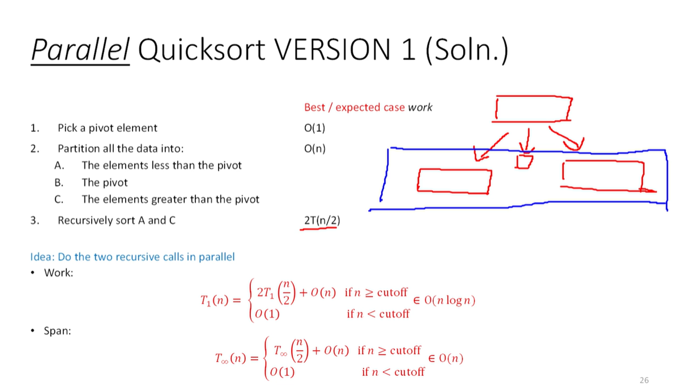

# Cheat Sheet (Final Exam Study Guide)
{: .no_toc }

CSE 332
{: .fs-6 .fw-300 }

---

<details open markdown="block">
  <summary>
    Table of contents
  </summary>
  {: .text-delta }
1. TOC
{:toc}
</details>

---

## Sorts

| Sort | Runtime | Stability | In-Place |
| Insertion Sort | Best Case: $$\mathcal{O}(n)$$. Worst Case: $$\mathcal{O}(n^2)$$. Average case: $$\mathcal{O}(n^2)$$ | Stable | In-Place |
| Selection Sort | $$\mathcal{O}(n^2)$$ | Not Stable | In-Place |
| Heap Sort | $$\mathcal{O}(n\log n)$$ | Not Stable | In-Place |
| Merge Sort | $$\mathcal{O}(n\log n)$$ | Stable | Not In-Place |
| Quick Sort (Hoare Partition) | Best Case: $$\mathcal{O}(n\log n)$$. Worst Case: $$\mathcal{O}(n^2)$$. Average case: $$\mathcal{O}(n\log n)$$ | Not Stable | In-Place |
| Bucket Sort | $$\mathcal{O}(n+k)$$ | Stable | Not In-Place |
| Radix Sort | $$\mathcal{O}(d \cdot (n+k))$$ | Stable | Not In-Place |

### Insertion Sort
Main a sorted subarray at the beginning of the array.
1. Sort the first 2 elements.
2. Insert the third element, in order.
3. Insert the fourth element, in order.
4. ...

```
5 2 3 1 4 9 8 7 6 0     i = 0
2 5 3 1 4 9 8 7 6 0     i = 1
2 3 5 1 4 9 8 7 6 0     i = 2
1 2 3 5 4 9 8 7 6 0     i = 3
1 2 3 4 5 9 8 7 6 0     i = 4
1 2 3 4 5 9 8 7 6 0     i = 5
1 2 3 4 5 8 9 7 6 0     i = 6
1 2 3 4 5 7 8 9 6 0     i = 7
1 2 3 4 5 6 7 8 9 0     i = 8
0 1 2 3 4 5 6 7 8 9     i = 9
```

### Selection Sort
Maintain a sorted subarray at the   end of the array.
1. Find the smallest element in the array.
2. Swap it with the first element. (of the unsorted subarray)
3. Repeat.

```
5 2 3 1 4 9 8 7 6 0     i = 0
0 2 3 1 4 9 8 7 6 5     i = 1
0 1 3 2 4 9 8 7 6 5     i = 2
0 1 2 3 4 9 8 7 6 5     i = 3
0 1 2 3 4 9 8 7 6 5     i = 4
0 1 2 3 4 5 8 7 6 9     i = 5   
0 1 2 3 4 5 6 7 8 9     i = 6
0 1 2 3 4 5 6 7 8 9     i = 7
0 1 2 3 4 5 6 7 8 9     i = 8
0 1 2 3 4 5 6 7 8 9     i = 9
```

### Heap Sort
1. Build a max heap.
2. Swap the first and last elements.
3. Remove the last element from the heap.
4. Repeat.

### Merge Sort
1. Split the array in half.
2. Recursively sort each half.
3. Merge the two sorted halves.

By parallelizing mergesort's merge step, even in the worst-case situation (one subarray has 3/4 elemetns and the other has 1/4), we have $$\mathcal{O}(n)$$ work and $$\mathcal{O}(\log^2 n)$$ span.
When considered with the full mergesort algorithm, we go from $$\mathcal{O}(n \log n)$$ work to $$\mathcal{O}(\log^3)$$ runtime.

### Quick Sort
1. Pick a pivot.
2. Partition the array around the pivot.
3. Recursively sort each half.


Hoare partition
- Pick 3 elements: first, middle, last. Choose the median of three as your pivot.
- Swap the pivot with the last element.
- Partition the array around the pivot.


Parallel quicksort:




Alternatively, use parallel pack for parallel partitioning. Do two filters: elements less than pivot, and all of the elements greater than the pivot. 
However we lose the in-place requirement, they have to be their own subarrays.

A pack is $$\mathcal{O}(\log n)$$ span. So you can reduce the span of quicksort to $$\mathcal{O}(\log^2 n)$$.

| Parallel Split | Parallel Partition | Runtime / Span |
| --- | --- | --- |
| No | No | $$\mathcal{O}(n\log n)$$ |
| Yes | No | $$\mathcal{O}(\log n)$$ |
| Yes | Yes | $$\mathcal{O}(\log^2 n)$$ |

### Bucket Sort
- For a small range of integers, just get a tally of each number.
- Find a min and max value. Make an aux array to represent the range between min and max.
- Go thruogh the original array and start tallying each number.
- Copy the aux into the original array.

Runtime is $$\mathcal{O}(n+k)$$, where $$k$$ is the range of the integers.
We need to first iterate over the original array to do the tally. Then we need to iterate over the auxilliary array to write the values back into the original array.

For non-integer data, each entry is not a tally but rather just a linked list. Dump the new data into the back of the linked list to get a stable sort.

### Radix Sort
1. Begin with the ones place and run bucket sort.
2. Move on to the tens place and run bucket sort.
3. Repeat until you reach the most significant digit.

Runtime is $$\mathcal{O}(d \cdot (n+k))$$, where $$d$$ is the number of digits in the largest number.

---

## Hash Tables

### Load Factor
$$\lambda = \frac{n}{m}$$ where $$n$$ is the number of elements and $$m$$ is the number of buckets.

### Double Hashing
- Quadratic probing with $$f(i) = i^2$$ does not resolve collisions between keys that initally hash to the same index, producing secondary clustering.

$$f(i) = i \cdot h'(key)$$, where $$h'$$ is a second hash function. Rephrased, we increment in multiples of another hash.

- If two keys hash to the same index, it is unlikely that they will follow the same probe sequence.
- While we prevent secondary clustering (possibly), we run the risk of infinite cycles


### Runtimes
- Insertion: $$\mathcal{O}(\lambda )$$
- Deletion: $$\mathcal{O}(\lambda )$$
- Lookup: $$\mathcal{O}(\lambda )$$


---

## Graphs

### Dijkstra's Algorithm
Runs in $$\mathcal{O}(V \log V + E \log V)$$ time using adjacency list with priority queue. Vertex-based. Runtime derivation:
- $$\mathcal{O}(V \log V)$$ for the priority queue, since we are dealing with $$V$$ vertices and need to sort them by their path distance from the source.
- $$\mathcal{O}(E \log V)$$ for the edge relaxation, since we are dealing with $$E$$ edges and need to update the priority queue for each edge.
Unoptimized time: $$\mathcal{O}(V^2 + E)$$.

### Topological Sort
Algorithm: 
1. Find a vertex with no incoming edges.
2. Add it to the topological sort.
3. Remove it and all outgoing edges from the graph.
4. Update priorities.
5. Repeat.

The maximum number of topological sorts for a connected directed graph with $$n$$ nodes is $$(n - 1)!$$.

### Minimum Spanning Trees
A **spanning tree** of a graph is a subgraph that is a tree and contains all vertices.

There are $$\vert V \vert - 1$$ edges in an MST.

### Prim's Algorithm
Vertex-based.

### Kruskal's Algorithm
Edge-based.


Worst-case runtime: $$\mathcal{O}(E \log V)$$. Uses disjoint set data structure with worst-case amortized runtime $$\log V$$.

---

## Parallelism

### Basic Terminology
- **Work.**
- **Span.**
- **Race condition.** When the result of a computation depends on the order of execution of the instructions, and may be incorrect.
- **Data race.** When a bad interleaving will crash the code, i.e. a simultaneous read/write or write/write to the same location. 

### Amdahl's Law
- Let the work (time to run on 1 processor) be 1 unit time. $$T_1 = 1$$
- Let $$S$$ be the portion of the execution which cannot be parallelized.
- Then, we have $$T_1 = S + (1 - S) = 1$$
- Let us get perfect linear speedup on the parallel portion such that $$T_P = S + \frac{1 - S}{P}$$

The theoretical overall speedup with $$P$$ processors is

$$\frac{T_1}{T_P} = \frac{1}{S + \frac{1 - S}{P}}$$

### Parallel Prefix Algorithm
1. Begin from bottom up such that $$\text{parent} = f(\text{left child}, \text{right child})$$ for some $$f$$ (e.g. adding, multiplying, max, etc.).
2. Begin from top down such that the left child has the same value as the parent, and the right child has the value of the parent's leftsum plus the left child's value.
3. The output for each element is that value plus the corresponding leftvalue.


