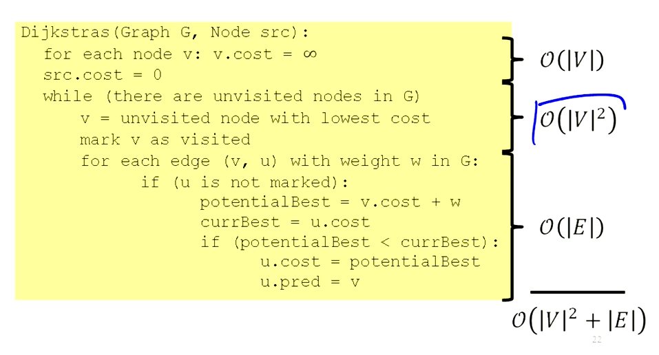
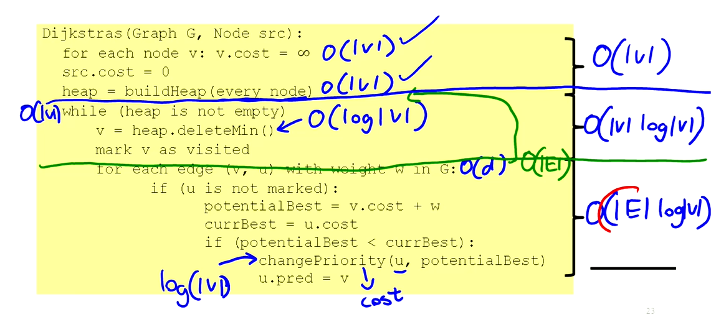
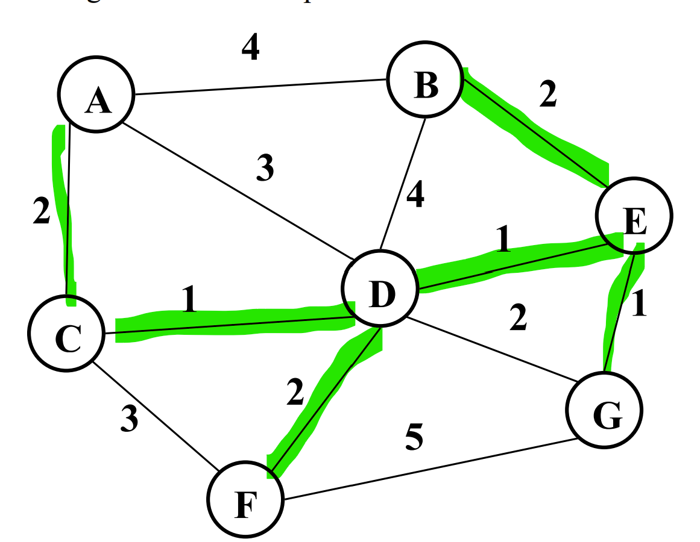
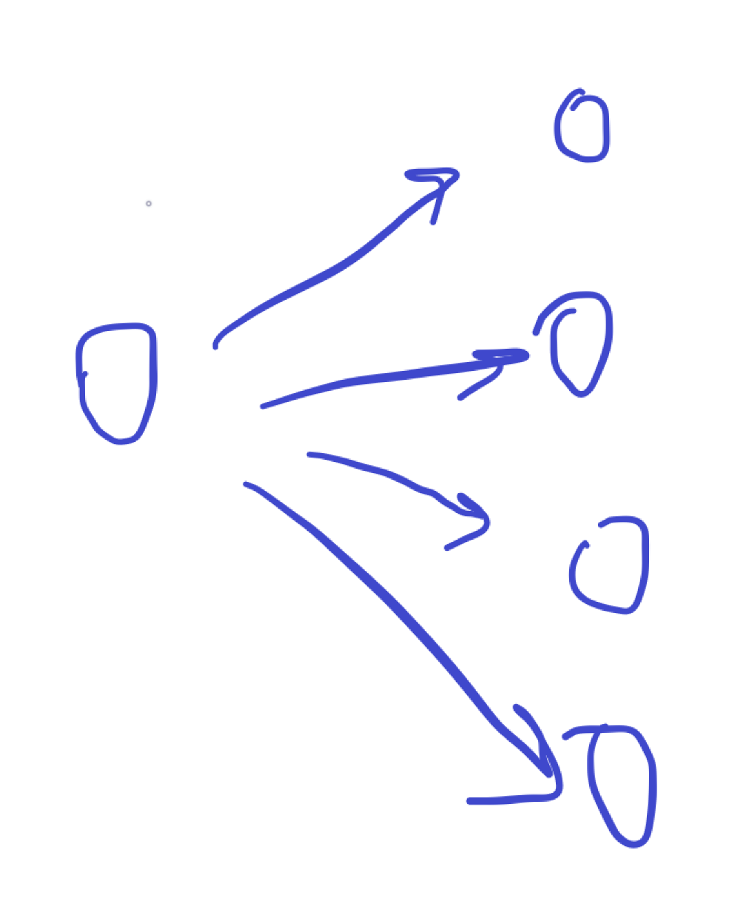
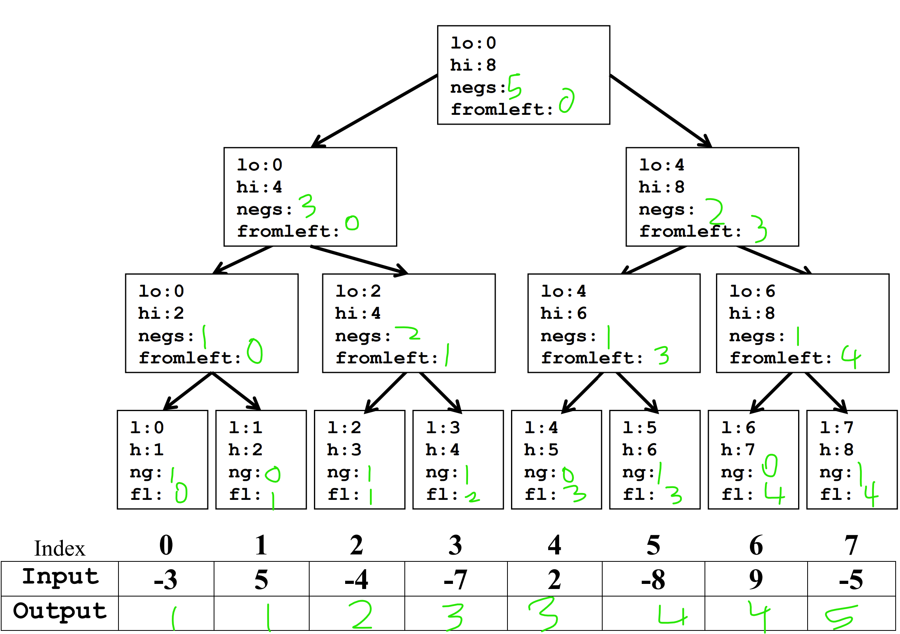
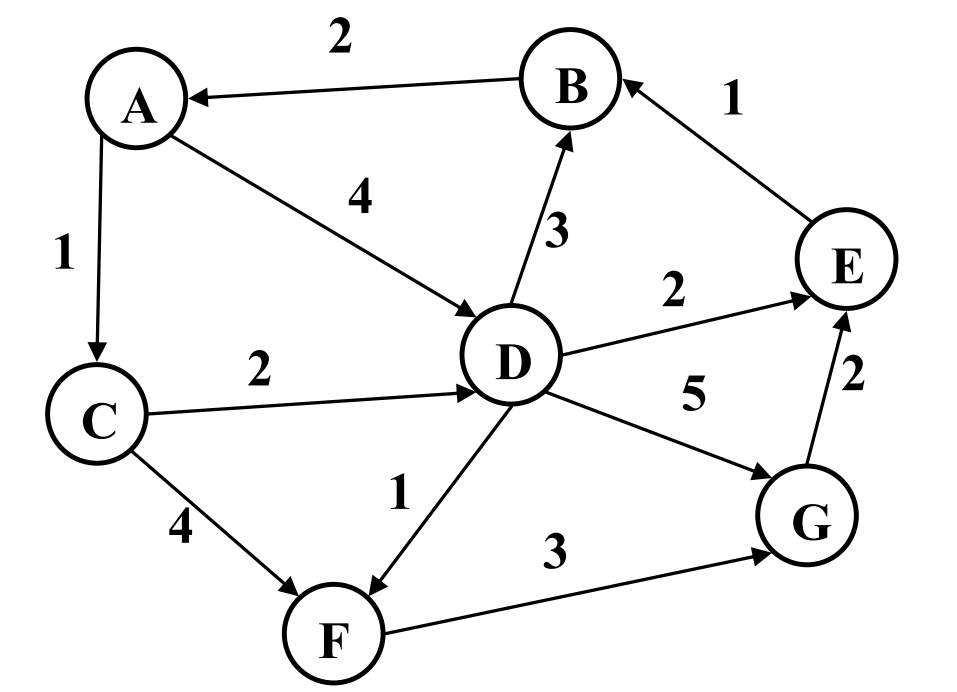
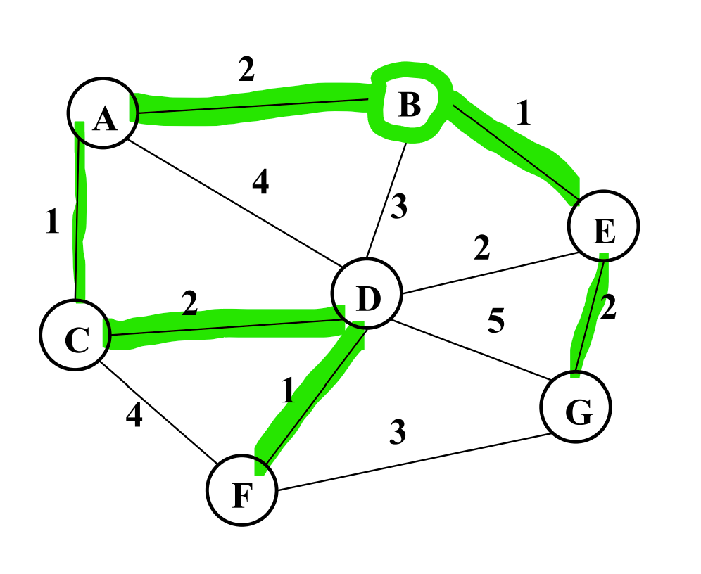
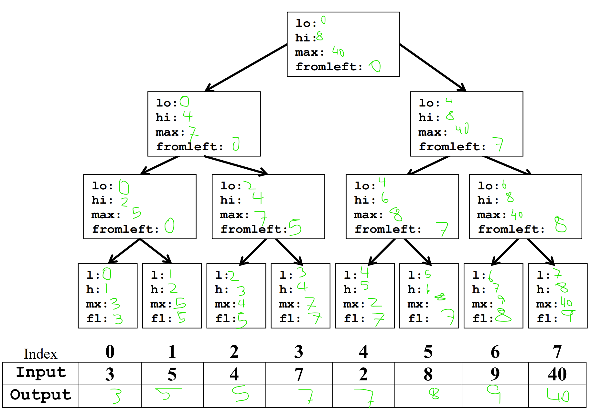
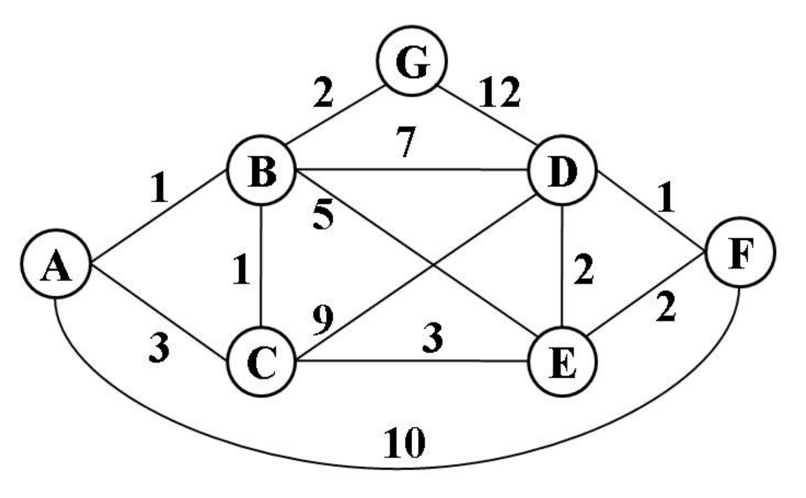

# Problem Bank
{: .no_toc }

CSE 332
{: .fs-6 .fw-300 }

---

## 2019 Winter Final

## 2019 Autumn Final

## 2016 Autumn Final
**Q1a.** Insert the following elemetns in order into a quadratic probing hash table: 50, 21, 29, 10, 39, 19. For each table, you should use the primary hash function $$h(k) = k \% 10$$.

| 0 | 1 | 2 | 3 | 4 | 5 | 6 | 7 | 8 | 9 |
| --- | --- | --- | --- | --- | --- | --- | --- | --- | --- |
|   |   |   |   |   |   |   |   |   |   |

| 0 | 1 | 2 | 3 | 4 | 5 | 6 | 7 | 8 | 9 |
| --- | --- | --- | --- | --- | --- | --- | --- | --- | --- |
| 50 |   |   |   |   |   |   |   |   |   |

| 0 | 1 | 2 | 3 | 4 | 5 | 6 | 7 | 8 | 9 |
| --- | --- | --- | --- | --- | --- | --- | --- | --- | --- |
| 50 | 21 |   |   |   |   |   |   |   |   |

| 0 | 1 | 2 | 3 | 4 | 5 | 6 | 7 | 8 | 9 |
| --- | --- | --- | --- | --- | --- | --- | --- | --- | --- |
| 50 | 21 |   |   |   |   |   |   |   | 29 |

| 0 | 1 | 2 | 3 | 4 | 5 | 6 | 7 | 8 | 9 |
| --- | --- | --- | --- | --- | --- | --- | --- | --- | --- |
| 50 | 21 |   |   | 10 |   |   |   |   | 29 |

(Inserted 10 with quadratic probing)

| 0 | 1 | 2 | 3 | 4 | 5 | 6 | 7 | 8 | 9 |
| --- | --- | --- | --- | --- | --- | --- | --- | --- | --- |
| 50 | 21 |   | 39 | 10 |   |   |   |   | 29 |

(Inserted 39 with quadratic probing)

| 0 | 1 | 2 | 3 | 4 | 5 | 6 | 7 | 8 | 9 |
| --- | --- | --- | --- | --- | --- | --- | --- | --- | --- |
| 50 | 21 |   | 39 | 10 |   |   |   | 19 | 29 |

(Inserted 19 with quadratic probing)

**Q1b.** Insert the following elements in order into a separate chaining hash table: 50, 21, 29, 10, 39, 19. For each table, you should use the primary hash function $$h(k) = k \% 10$$.

| 0 | 1 | 2 | 3 | 4 | 5 | 6 | 7 | 8 | 9 |
| --- | --- | --- | --- | --- | --- | --- | --- | --- | --- |
|   |   |   |   |   |   |   |   |   |   |

| 0 | 1 | 2 | 3 | 4 | 5 | 6 | 7 | 8 | 9 |
| --- | --- | --- | --- | --- | --- | --- | --- | --- | --- |
| 50 |   |   |   |   |   |   |   |   |   |

| 0 | 1 | 2 | 3 | 4 | 5 | 6 | 7 | 8 | 9 |
| --- | --- | --- | --- | --- | --- | --- | --- | --- | --- |
| 50 | 21 |   |   |   |   |   |   |   |   |

| 0 | 1 | 2 | 3 | 4 | 5 | 6 | 7 | 8 | 9 |
| --- | --- | --- | --- | --- | --- | --- | --- | --- | --- |
| 50 | 21 |   |   |   |   |   |   |   | 29 |

| 0 | 1 | 2 | 3 | 4 | 5 | 6 | 7 | 8 | 9 |
| --- | --- | --- | --- | --- | --- | --- | --- | --- | --- |
| 10 $$\to$$ 50 | 21 |   |   |   |   |   |   |   | 29 |

| 0 | 1 | 2 | 3 | 4 | 5 | 6 | 7 | 8 | 9 |
| --- | --- | --- | --- | --- | --- | --- | --- | --- | --- |
| 10 $$\to$$ 50 | 21 |   |   |   |   |   |   |   | 29 $$\to$$ 39 |

| 0 | 1 | 2 | 3 | 4 | 5 | 6 | 7 | 8 | 9 |
| --- | --- | --- | --- | --- | --- | --- | --- | --- | --- |
| 10 $$\to$$ 50 | 21 |   |   |   |   |   |   |   | 19 $$\to $$ 29 $$\to$$ 39 |

**Q1c.** *What is the load factor of each table?*

- Open addressing: $$\alpha = \frac{6}{10} = 0.6$$
- Separate chaining: $$\alpha = \frac{6}{10} = 0.6$$

**Q1d.** *In a sentence or two, describe double hashing.*

**Q1f.** *What is the big-O worst case runtime of a find operation on a table like table b?*

The worst case runtime for table B would be where if all the elements were placed in a single cell as a linked list, yielding $$\mathcal{O}(n)$$ time.

**Q1g.** *What is the big-O worst case runtime of an Insert in a separate chaining hash table containing N elements where each bucket points to an AVL tree?*

In this case, in the worst case scenario in which all of the data is in one bucket, the AVl tree is at least balanced, which gives us a worst time of $$\mathcal{O}(\log n)$$ time.

**Q2a.** *What is the big-O running time of Dijkstra's algorithm assuming an adjacency list representation if a priority queue is used, or if an unsorted list is used?*

With a priority queue, it would be $$\mathcal{O}(V \log V + E\log V)$$. 
With an unsorted list, it would be $$\mathcal{O}(EV + V^2)$$.

We begin by initializing all costs to infinity, which is $$O(V)$$.
Then we loop over all unvisited nodes, which is $$\mathcal{O}(V)$$. We then find the minimum cost node, which is $$\mathcal{O}(V)$$ for an unsorted array. For each edge from the node, we do all of the stuff... this is $$\mathcal{O}(d)$$, where $$d$$ is the number of outgoing edges.
But when we multiply this by $$|V|$$, we get $$\mathcal{O}(V^2 + E)$$ as $$V \cdot d = E$$.



We can reduce the time for searching to $$\mathcal{O}(\log V)$$ using a heap, which gives us the term $$\mathcal{O}(V \log V)$$. But we also need to change the key, which is $$\mathcal{O}(\log V)$$, and we need to iterate over this possibly $$\mathcal{O}(E)$$ times (in total b/c we end up iterating over all edges), which gives us $$\mathcal{O}(E \log V)$$. So the total runtime is $$\mathcal{O}(V \log V + E \log V)$$.



**Q2b.** *Which implementation of Dijkstra’s (priority queue vs. unsorted list) is likely to be faster if the graph is known to be dense?*
Using a priority queue would be faster regardless. $$\mathcal{O}(\log V)$$ always beats $$\mathcal{O}(V)$$.

**Q2c.** *Give a Minimum Spanning Tree (MST) of the graph below by highlighting the edges that would be part of the MST.*

Using Kruskal's algorithm:



**Q2d.** *You are given a perfect binary tree of height h containing n nodes. Your answer should be an exact formula, not big-O notation.*

*(i) Depth First Search: What is the name of the data structure used in DFS?*

Stack

*What is the maximum size of that data structure during a DFS?*

$$h+1$$, because we have to store the root and all of the nodes in the longest path to store at the maximum

*Breadth First Search: What is the name of the data structure used in BFS?*

Queue

*What is the maximum size of that data structure during a BFS?*

$$2^h$$, because we have to store all of the nodes in the bottom row of the tree at one time.

**Q3a.** *Draw a picture of a connected directed graph with 5 nodes that has the largest possible number of topological sorts. How many different topological sorts does it have?*



There are $$4!$$ possible toposorts. This is the maximum number of toposorts, since it's the general number of arrangements of nodes. 

**Q3b.** *Given a weighted, undirected graph with |V| nodes, answer the following. Assume all weights are non-negative.*

*If each edge has weight $$\le$$ w, what can you say about the cost of an MST? Your answer should give a lower bound, or an upper bound on the cost of the MST.*

The cost of the MST is at most $$w\cdot (\vert V \vert - 1)$$, because there are $$\vert V \vert - 1$$ edges in the MST, and each edge has weight $$\le$$ w. 

*If the cost of an MST is c, what can you say about the shortest distances returned by Dijkstra’s algorithm when run with an arbitrary vertex s as the source? You should give a lower bound or an upper bound for the distance between arbitrary vertices u and v.*

The shortest distance between any two points is less than $$c$$, as these two points will be connected via the MST.

*If there exists a Hamiltonian circuit of cost c, then what can you say about the cost of the minimum spanning tree ?*

The cost is at most $$c$$, since we can remove one edge from the Hamiltonian circuit to get a spanning tree, but this may not be the minimum one.

**4a.** *Given the following array as input, perform the parallel prefix algorithm to fill the output array with the number of negative values contained in all of the cells to the left in the input array.*



**Q6.** *Concurrency: Once again, we are helping out with the Aviation Management System. This time they have a data structure that keeps track of whether there is a flight from one airport to another. If there is a flight from airport x to airport y, then we should be able to assume that there is also a flight from airport y to airport x. This information is being kept in an array (indexed by unique airport number), where each location in the array points to a list of the airport numbers that can be reached from this airport by a single flight (an AirportList). We would like to allow as much concurrent access to this data structure as possible, while assuring that each thread always sees a consistent state of the data structure. We attempt this by having a different lock on each of the AirportLists.*

*Our first attempt at the removeRoute method is below. Assume hasFlightTo and removeFlight are methods on an AirportList. removeFlight will throw an exception if the specified flight is not present.*

```java
void removeRoute1(int x, int y, AirportList[] airports) {
    synchronized(airports[x]) {
        synchronized(airports[y]) {
            if(airports[x].hasFlightTo(y)) {
                airports[x].removeFlight(y);
                airports[y].removeFlight(x);
            }   
        }
    }
}
```

*Does the code above have potential for deadlock, a data race, or a race condition?*

Potential for deadlock.

```
Thread 1                          Thread 2
removeRoute(a, b, airports)       removeRoute(b, a, airports)
    synchronized(airports[a]) {    synchronized(airports[b]) {
        waiting on airports[b]     waiting on airports[a]
    }                             }
```

*Our second attempt at the removeRoute method is below.*

```java
void removeRoute2(int x, int y, AirportList[] airports) {
    synchronized(airports[x]) {
        if(!(airports[x].hasFlightTo(y))) {
            return;
        }
    }
    synchronized(airports[x]) {
        airports[x].removeFlight(y); 
    }
    synchronized(airports[y]) {
        airports[y].removeFlight(x);
    }
}
```

*Does the code above have potential for deadlock, a data race, or a race condition?*

A race condition. Imagine that thread 2 runs the entire method after thread 1 calls `airports[x].removeFlight(y)`. Then when thread 1 calls `airports[y].removeFlight(x)` there will be an exception thrown.

*Finally, the developers’ consider scrapping the one-lock-per AirportList strategy in favor of a single lock, locking the entire array of AirportLists.*

*One benefit of a single-lock locking all airports:*
Everything will be airtight and there is zero risk of error, provided everything is correctly implemented.

*One drawback of a single-lock locking all airports:*
There is basically no benefit to parallelism because the entire data structure can only be accessed by one thread at a time.

**Q7a.** *You are given a list of AVL trees. The keys in the AVL trees are ages of people. Each AVL tree represents the ages for people in a different community. Your task is to sort the AVL trees such that tree X comes before tree Y if and only if the minimal age in tree X is less than the minimal age in tree Y or the minimal ages are the same, but the maximal age in tree X is less than the maximal age in tree. Otherwise, ties are broken arbitrarily. You may assume that there are k trees, each tree has n keys in it, and the range of ages is fixed (0-127).*

*Describe in a few sentences or numbered steps how you could use Mergesort to sort these trees efficiently in the worst case. What is the running time in terms of k and n?*

In the worst case, all of the trees have the same minimum age and we need to compare the maximal age. Finding the maximum age in an AVL tree is $$\mathcal{O}(\log n)$$.
Mergesort across $$k$$ elements runs in $$\mathcal{O}(k \log k)$$ time. So the total runtime is $$\mathcal{O}(k \log k + k \log n)$$.

*Describe in a few sentences or numbered steps how you could use ideas from Radixsort to sort these trees efficiently in the worst case. What is the running time in terms of k and n?*

Radix Sort begins from the least significant digit and runs a sort, then moves onto more significant digits. Similarly, in this case, we could first run a sort on the maximum age. This would take runtime $$\mathcal{O}(k + 128) = \mathcal{O}(k)$$ time. Mutliplying this by the $$\mathcal{O}(\log n)$$ time it takes to get the maximum yields $$\mathcal{O}(k \log n)$$.
Then run a bucket sort on the minimum age, which is also $$\mathcal{O}(k)$$ time. So the total runtime is $$\mathcal{O}(k)$$.
This gives us a total runtime of $$\mathcal{O}(k \log n)$$.

**8a.** *Give the recurrence for mergesort (parallel sort and sequential merge), best case span.*

$$T(n) = T(n/2) + O(n)$$

Normally it would be $$T(n) = 2T(n/2) + O(n)$$, but since we are doing a parallel sort, we can do both halves in parallel. So the span is $$\mathcal{O}(\log n)$$.

**8b.** *Order these sorts from slowest to fastest in terms of big-O runtimes. For parallel sorts, use the span.*

1. Quicksort (sequential) - worst case ($$\mathcal{O}(n^2)$$
2. Mergesort(sequential) - worst case,  Quicksort (sequential) - best case, Quicksort (parallel sort & parallel partition) - worst case span ($$\mathcal{O}(n \log n)$$)
3. Quicksort (parallel sort & parallel partition) - worst case span ($$\mathcal{O}(\log^2 n)$$

**8c.** *Suppose we choose the median of five items as the pivot in quicksort. If we have an N element array, then we find the median of the elements located at the following positions: left (= 0), right (= N – 1), center (the average of left and right, rounded down), leftOfCenter (the average of left and center, rounded down), and rightOfCenter (the average of right and center, rounded down). The median of these elements is the pivot.*

Still $$\mathcal{O}(n^2)$$. This is if all of the elements in the array are the same value.

**8d.** *Any algorithm for sorting must take $$\Omega(N log N)$$ time in the worst-case.*

False.

**9a.** *"NP" stands for* non-deterministic polynomial.

**9b.** *What does it mean for a problem to be in NP-complete?*

Firstly, it must be in NP, which means that a solution can be verified by an algorithm in polynomial time.
Moreover, all NP problems must reduce to this problem for it to be NP-complete.
To be reducible to another problem means that you can solve your problem using a polynomial number of calls to the other problem's solver.

**9c.** *For the following problems, circle ALL the sets they belong to.*

- Determining if a chess move is the best move an N by N board: none
- Finding the maximum value in an array: NP, P
- Finding a cycle that visits every vertex in a graph exactly once: NP, NP-complete
- Finding a cycle that visits every edge in a graph exactly once: P, NP
- Determine if a program will ever stop running: none

**9d.** *If there exists a polynomial time algorithm to solve Euler Circuit, then there exists a polynomial time algorithm to solve SAT.* False.

**9e.** *If there exists a polynomial time algorithm to solve Hamiltonian Circuit then any problem in NP can be solved in polynomial time.* True.


## 2015 Winter Final
**Q1a.** *This is actually a sort mentioned in class. What sort is this?*

```java
SunnySort(int[] sun) {
    for (int i = 1; i < size; i++) {
        int j;
        int temp = sun[i];
        for (j = i; j > 0 && temp < sun[j-1]; j--) {
            sun[j] = sun[j-1];
        }
        sun[j] = temp;
    }
}
```

Insertion sort.

**Q1b.** *Describe the best and worst case data set for this sort. (If all cases behave similarly, please state that.) What is the big-O running time of those two data sets?*

- Best case dataset: an already sorted array. Runtime is $$\mathcal{O}(n)$$.
- Worst case dataset: reverse-sorted array. Runtmie is $$\mathcal{O}(n^2)$$.

**Q1c.** *Is it an in-place sort? Why or why not?*

Yes, it is in-place, which means that it does not require any (varying) additional memory to store the array. It is in-sort because it merely rearranges elements in the array.

**Q1d.** *Is it a stable sort? Why or why not?*

Yes, it is stable, meaning that it preserves the order of elements with equal keys in the sorting procedure.
It is stable because it only swaps elements if the element to the left is greater than the element to the right. If the elements are equal, then the element to the left is not greater than the element to the right, so no swap occurs.

**Q2a.** *What is the running time of Dijkstra’s algorithm (assuming an adjacency list representation, and priority queues are used)?*

Dijkstra's algorithm runs in $$\mathcal{O}(V \log V + E \log V)$$ time.

**Q2b.** *Given a graph with |V| vertices and |E| edges, what is the space requirement (in big-O) for representing the graph?*

*For an adjacency list*: $$\mathcal{O}(V + E)$$

*For an adjacency matrix*: $$\mathcal{O}(V^2)$$

**Q2c.** *Which of the two graph representations is preferable for a sparse graph (in terms of using the smallest amount of space) (choose the best answer)?*

An adjacency list is preferable for a sparse graph because it uses $$\mathcal{O}(V + E)$$ space, whereas an adjacency matrix uses $$\mathcal{O}(V^2)$$ space.

**Q3a.** List a valid topological ordering of the nodes in the graph.



There is no valid topological ordering of the nodes in the graph because there is a cycle.

**Q3b.** *Use Dijkstra's algorithm to calculate the single ource shortest path from A to every other vertex.*

| Vertex | Known | Distance | Path |
| --- | --- | --- | --- |
| A | yes | 0 |  |
| B | yes | 6 | D |
| C | yes | 1 | A |
| D | yes | 4, 3 | A, C |
| E | yes | 5 | D |
| F | yes | 5 , 4| C, D |
| G | yes | 8, 7 | A, C, D, G |

**Q3c.** *In what order would Dijkstra's algorithm mark each node as known?*

A, C, D, F, E, B, G

**Q3d.** *List the shortest path from A to G?*

A, C, D, F, G

**Q3e.** *For each modification to the graph on the previous page described below, indicate whether the modification would cause Dijkstra’s algorithm to fail to find a shortest path when starting at A. That is, running Dijkstra’s would find a shortest path from A to some vertex which was not the actual shortest path to that vertex. Assume each modification is applied independently to the original graph (they are not all combined).*

*Add an edge DC with weight of -4*. Dijkstra's would fail, because for instance the shortest path would be A to D to C whereas it would find A to C. This is because Dijkstra does not revisit nodes once it has visited them. This is thrown for a wrench by negative weights because they can 'undo' weight progress.

*Change weight on edge AC to -2*. Not a problem, Dijkstra would have found AC anyway. All important relationships hold.

**Q4f.** Give an MST of the graph.



**Q4g.** *Kruskal’s algorithm to find the minimum spanning tree made use of a data structure we only used for Kruskal’s called* a disjoint set.

**Q4.** *In Java using the ForkJoin Framework, write code to solve the following problem. Input: An array of ints (does not contain duplicates). Output: the maximum value and its location (index) in the Input array.

```java
import java.util.concurrent.ForkJoinPool;
import java.util.concurrent.RecursiveTask;

class Pair { // You are not required to use this class
    int a;
    int b;
    public Pair (int a, int b) {
        this.a = a;
        this.b = b;
    }
}

class Main{
    static final ForkJoinPool fjPool = new ForkJoinPool();
    Pair findMax (int[] array) {
        return fjPool.invoke(new FindMax(array, 0, array.length));
    }
}

class FindMax extends RecursiveTask {
    int[] array;
    int start;
    int end;
    public FindMax (int[] array, int start, int end) {
        this.array = array;
        this.start = start;
        this.end = end;
    }
    protected Pair compute () {
        if (end - start <= 1) {
            return new Pair(array[start], start);
        }
        int mid = (start + end) / 2;
        FindMax left = new FindMax(array, start, mid);
        FindMax right = new FindMax(array, mid, end);

        left.fork();
        Pair rightAns = right.compute();
        Pair leftAns = left.join();

        if (leftAns.a > rightAns.a) {
            return leftAns;
        } else {
            return rightAns;
        }
    }
}
```

**Q5.** *Given a program where 75% of it is parallelizable (and 25% of it must be run sequentially) what is the maximum speedup you would expect to get with 5 processors.*

25% is constant, but the remaining 75% can be divided between the 5 processors, which gives us 15% for each processor. Therefore we would expect a speedup of $$\frac{40}{100}^{-1} = \frac{100}{40} = 2.5$$.


**Q6.** *Given the following array as input, perform the parallel prefix algorithm to fill the output array with the maximum value contained in all of the cells to the left (including the  value contained in that cell) in the input array.*



**Q7.**  *The following class implements a dictionary storing (int key, E data) pairs as a “move to front” unsorted linked list. It assumes no duplicate keys will be inserted.*
```java
public class MoveToFrontList<E> {
    private Node front = null;
    // Remove Node containing key from the list & return data 
    // associated with key or null if key not found.
    synchronized E delete(int key){…}
    // Insert (key, data) at the front of the list.
    synchronized void insert(int key, E data){
        front = new Node(key, data, front);
    }
    // Find (key, data) and move to the front of the list.
    // Return data associated with key or null if key not found.
    E findAndMove(int key){
        E tempData = delete(key);
        if (tempData != null) insert(key, tempData);
        return tempData;
    }
}
```

*Does the code above have*
- *potential for deadlock?* No
- *a data race?* No
- *a race condition?* Yes

*If possible, show (using code as done in class) an interleaving of two or more threads where a value that is in the list would not be found. If not possible, explain why not.*

Consider the case in which thread 1 and thread 2 both have the same key, and thread 2 attempts to delete the key after thread 1 has already deleted it.


*If we change the findAndMove method to be synchronized, now, does the code above have (circle all that apply)*

None!

*Say we added another find method to this class that only finds values, but does not move them (does not modify the list). (See the code for find on the next page.) If all other methods are synchronized, but our new find method is not synchronized, does the code above plus this new find method have (circle all that apply):*

A data race and a race condition: `find` reads from the front while another thread may be writing to it, so we get a read/write situation.

**Q8a.** *Give a formula for the worst case big-O running time of radix sort.**

$$\mathcal{O} \left( \log_{\text{radix} \text{max_value} \cdot (n + \text{radix})} \right)$$

**Q8b.** GIve the recurrence for each of the following.

Quicksort (parallel sort & parallel partition), best case and worst case

$$\text{Best:} T(n) = \mathcal{O}(\log n) + T(n / 2) $$
$$\text{Worst:} T(n) = \mathcal{O}(n) + T(n - 1) $$

**Q8c.** Give big-O runtimes of the following in terms of $$n$$.

- Mergesort (sequential), worst case: $$\mathcal{O}(n \log n)$$
- Quicksort (parallel sort & partition), best case span: $$\mathcal{O}(\log^2 n)$$
- Quicksort (parallel sort & partition), worst case span: $$\mathcal{O}(n \log n)$$
- Quicksort (sequential), best case: $$\mathcal{O}(n \log n)$$
- Quicksort (sequential), worst case: $$\mathcal{O}(n^2)$$

**Q9a.**  An insert operation on a BST has
- Worst case running time $$\mathcal{O}(n)$$ (linked list)
- Average case running time $$\mathcal{O}(\log n)$$ (balanced tree)
- Amortized running time $$\mathcal{O}(n)$$

## 2012 Winter Final

## 2012 Summer Final

## 2012 Spring Final

## 2010 Summer Final

## 2010 Spring Final

**Q1.** Suppose we sort an array of numbers, but it turns out every element of the array is the same, e.g.,
{17, 17, 17, ..., 17}. (So, in hindsight, the sorting is useless.)

*What is the asymptotic running time of insertion sort in this case?*

The runtime is $$\mathcal{O}(n)$$ because the algorithm begins from the first 2 elements and progressively inserts the $$i$$th element into the sorted subarray such that it remains sorted. Because all of the elements are the same this insertion is totally uneeded, and we end up just looping through the array. 

*What is the asymptotic running time of selection sort in this case?*

The runtime is $$\mathcal{O}(n^2)$$ because the algorithm begins from the first 2 elements and progressively swaps the $$i$$th element with the smallest element in the unsorted subarray. Because all of the elements are the same this swap is totally uneeded, and we end up just looping through the array. Selection sort always uses $$\mathcal{O}(n^2)$$ time because it always loops through the array at each index of the array.
   
*What is the asymptotic running time of merge sort in this case?*

The runtime is $$\mathcal{O}(n\log n)$$ because the algorithm recursively splits the array in half until it reaches the base case of an array of size 1. Then it merges the arrays back together. Because all of the elements are the same, the merge is totally uneeded, and we end up just splitting the array in half until we reach the base case. Merge sort always uses $$\mathcal{O}(n\log n)$$ time because it always splits the array in half $$\log n$$ times and merges the arrays back together $$n$$ times.

*What is the asymptotic running time of quick sort in this case?*

The runtime is $$\mathcal{O}(n^2)$$ because the algorithm recursively partitions the array into 2 subarrays based on a pivot element. Because all of the elements are the same, the partition is totally uneeded, and we end up just splitting the array in half until we reach the base case. Quick sort always uses $$\mathcal{O}(n^2)$$ time because it always splits the array in half $$\log n$$ times and partitions the arrays back together $$n$$ times.

**Q2.**  Consider this code. Assume any client passes an appropriate Comparator object for comparing elements.

```java
interface Comparator<E> {
    int compare(E e1, E e2);
}

class C {
    static <E> boolean mystery(E[] array,
        Comparator<E> c) {
        for(int i=0; i < array.length-1; i++) {
            for(int j=i+1; j < array.length; j++) {
                if(c.compare(array[i],array[j])==0) return false;
            }
        }
        return true;
    }
}

```

* In English, what does mystery compute? Do not explain how it computes it.*

This function determines if the array's elements are totally unique.

*What is the worst-case running time of mystery in terms of n, the length of array?*

$$\mathcal{O}(n^2)$$

*Describe in English and/or pseudocode an algorithm for the same problem with running time O(n log n). You do not need to explain the implementation of any standard algorithms you use as part of your solution. Assume it is acceptable to mutate the contents of the array.*

Sort the array, and then loop through the array and check if the current element is equal to the next element. If it is, return false. If the loop finishes, return true.

*Now assume it is not acceptable to mtuate the contents of the array. How can you modify your algorithm to use extra space but not change the asymptotic running time?*

Copy the original array into another array which is mutable.

**Q3.** *Consider the following undirected, weighted graph:*



*Step through Dijkstra’s algorithm to calculate the single-source shortest paths from A to every other vertex. Show your steps in the table below. Cross out old values and write in new ones, from left to right within each cell, as the algorithm proceeds. Also list the  ertices in the order which you marked them known. Finally, indicate the lowest-cast path from node A to node F.*

| Vertex | Known? | Distance | Path |
| --- | --- | --- | --- |
| A | Yes | 0 | A |
| B | Yes | 1 | A, B |
| C | Yes | 2 | A, B, C |
| D | Yes | 7 | A, B, C, E, D |
| E | Yes | 5 | A, C, E |
| F | Yes | 7 | A, B, C, E, F |
| G | Yes | 3 | A, B, G |

Known Vertices: A, B, C, G, E, D, F

Least Cost Path from A to F: A, B, C, E, F

**Q4.** *In Java using the ForkJoin Framework, write code to solve the following problem:*
- *Input: A `String[]`*
- *Output: A Pair of (a) the number of words starting with the letter ’c’ and (b) the length of the longest word starting with the letter ’c’. (If no words start with ’c’, the length is irrelevant.)*

*Your solution should have O(n) work and O(log n) span where n is the array length. Do not employ a sequential cut-off: the base case should process one String.*

```java
import java.util.concurrent.ForkJoinPool;
import java.util.concurrent.RecursiveTask;
class Pair {
    int count;
    int longest;
    Pair(int c, int l) { count = c; longest = l; }
}
class Main{
    static final ForkJoinPool fjPool = new ForkJoinPool();
    Pair processCWords(String[] array) {
        return fjPool.invoke(new ProcessCWords(array,0,array.length));
    }
}
```

```java
class ProcessCWords extends RecursiveTask {
    Pair ProcessCWords(String array, int lo, int hi) {
        if (hi - lo <= 1) {
            if (array[lo].charAt(0) == 'c') {
                return new Pair(1, array[lo].length());
            } else {
                return new Pair(0, 0);
            }
        } else {
            int mid = lo + (hi - lo) / 2;
            ProcessCWords left = new ProcessCWords(array, lo, mid);
            ProcessCWords right = new ProcessCWords(array, mid, hi);

            return new Pair(left.count + right.count, Math.max(left.longest, right.longest));
        }
    }
}

```

**Q5.** You are at a summer internship working on a program that currently takes 10 minutes to run on a
4-processor machine. Half the execution time (5 minutes) is spent running sequential code on one
processor and the other half is spent running parallel code on all 4 processors. Assume the parallel
code enjoys perfectly linear speedup for any number of processors.
Note/hint/warning: This does not mean half the work is sequential. Half the running time is spent
on sequential code.
Your manager has a budget of $6,000 to speed up the program. She figures that is enough money to
do only one of the following:
- Buy a 16-processor machine.
- Hire a CSE332 graduate to parallelize more of the program under the highly dubious assumptions that:
    - Doing so introduces no additional overhead
    - Afterwards, there will be 1 minute of sequential work to do and the rest will enjoy perfect linear speedup
Which approach will produce a faster program? Show your calculations, including the total work done
by the program and the expected running time for both approaches.

If the manager purchases a 16-processor machine, the parallel component will be sped up by a factor of 4, such that the total execution time will now be 6.25 minutes (5 + 1.25). On the other hand, if we parallelize more of the program, there will be 1 minute of sequential work. There is still $$(5 + 4 \cdot 5) - 1 = 25 - 1 = 24$$ minutes of work to do. Parallelizing this across the existing 4 processors means it will take 6 minutes. Thus in total it will take 7 minutes. This is more than 6.25 minutes, so we buy the computer instead.

**Q6.** *Here is a simpler algorithm for finding the second smallest element in a binary search tree in terms of some other operations:*

```java
synchronized E deleteMin() { ... }
synchronized E findMin() { ... }
synchronized void insert(E x) { ... }
E secondSmallestFinal() {
    E min = this.deleteMin();
    E ans = this.findMin();
    this.insert(min);
    return ans;
}
```

* Suppose two threads call secondSmallestFinal concurrently. Demonstrate how one of them can get the wrong answer.*

Say that a binary search tree contains the elements 1, 2, and 3 (among other elements). 
Thread 1 calls the first line, deleting the minimum value of 1.
Thread 2 calls the first line, deleting the minimum value of 2.
At this point, thread 1 calls the second line and stores 3 to `ans`. Thread 1 re-inserts 1, and thread 2 re-inserts 2. Thread 2 returns 2, which is correct, but thread 1 returns 3, which is incorrect.

*Does the code above have any data races? Explain briefly*

No, because everything is synchronized. No code crashes, but the result can be wrong.

*What is the easiest way to fix secondSmallestFinal?*

Synchronize the entire block as a critical section.

**Q9.** *Apply Kruskal’s algorithm to compute a minimum spanning tree (MST).*


*Edges that form part of the MST, in the order considered:*

(A, B), (B, C), (D, F), (B, G), (D, E), (C, E)
