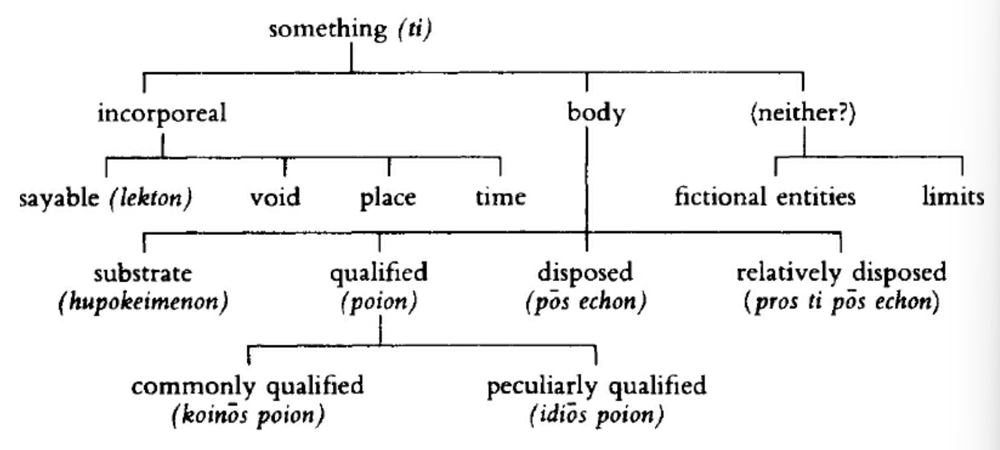

# Lecture Notes
{: .no_toc }

PHIL 430
{: .fs-6 .fw-300 }

---

  

    Table of contents
  

  {: .text-delta }
1. TOC
{:toc}

---

## Leucippus and Democritus Fragments
"Fifth-Century Atomism", from Curd & McKirahan, *Presocratics Reader*

- Leucippus -- the founding theorist of atomism, 440 to 430 BCE
- Democritus -- the most important atomist, and the first to write a book on the subject.- Epicurus even denied Leucipus existed.
- Concentration on atomism, a scientific and metaphysical theory begun by Leucippus and continued by Democritus.
- Atomism is in conflict to the teleological systems of Plato and Aristotle
- *Atomos* -- uncuttable. Atoms cannot be divided. There are an indefinite number of atoms. Atoms are imperceptible. All atomic stuff is the same. *Being*
- **The empty* / *void* -- void is where atoms are not. Atoms can move into the empty. *Nothingness*
    - Is nothingness somehting which exists? As a being?
    - Not simply the negation of what is
    - Void separates atoms
    - What appears to be coming and passing is merely arrangement of atoms and voids

1. All things are a result of reason and necessity -- determinism? Mechanism? "Materialism"?
2. The universe is both the empty (void) and the full. There is a sort of necessary entanglemetn / self-relating.
3. There are three modes of atomic expression: shape, arrangement, position, and these differences *cause* everything else. Aristotle: what is the "original cause"?
4. Democratic and Leucippus now propose a theory of lateration and coming-to-be. Being and non-being through separation/combination, alteration through arrangement/position. *Truth is in the appearance*; "opposite" things are merely same arrangements
    - "For tragedy and comedy come to be out of the same letters."
5. Democritus: eternal things are small substances (*ousia*, *ousiai*) in infinite quantity.
    - They inhabit the void, nothing, the unlimited
    - Substances are compact, finite, 'existing' 
    - Substances form visible / perceptible bodies
    - Substances *are at odds* (fundamental contradiction?) and move around the void
    - *Ousiai can become entangled, but never really one.*
6. Leucippus posited atoms as infinite, in contrast to the finitude of Parmenides and Xenophanes.
    - What is is no more than what is not. *Sartre?*
    - Infinite principles account for all attributes and substances
    - What is the cause of infiniteness?
7. Early philosophers hold that what-is is one and immovable. But Leucippus says: there can be no motion without void, and the things are infinite in number and invisible because of their smallness.
    - **Question!** Why atomism vs infinite divisibility of the world? And why not a finite number of atoms?
    - Atoms produce coming to be by combining and perishing, they generate compounds by becoming combined.
    - Plurality cannot come from what is actually merely one.
8. Each atom's nature is *one*.
9. Plato and Democritus -- only intelligible things are true/real. There is no perceptible substrate, since atoms have a nature without perceptibility.
    - What is a substrate?
10. Democritus: atoms have size and shape. Epicurus: weight.
11. Bodies differ in shape. Shapes are infinite. Simple bodies should be infinite.
12. Principles are infinite "in multitude" (???); atoms are indivisible and cannot be affected b/c they have no void.
    - Division: when there is void in bodies.
13. Bodies are composed of indivisible things; we reject division to infinity.
14. What is there which escapes division? There will always b esomehting which has not yet been divided. Magnitudes cannot be composed of contacts or points, so there must be indivisible bodies... (???) -- **need some clarification on the necessary existence of an indivisible body.**
15. Democritus does not mean "contact" in the sense of "touching", but rather being near each other. Atoms will always be separated by void.
16. There is no more reason for the thing to be than the nothing. Void has a nature / existence of its own, too.
17. "Void" -- an interval with no perceptible body. Everything that is, is body; so there must be no interval different from bodies (???). If there was,
    - there would be no change in place
18. Leucippus and Democrotisu -- say that primary bodies are walways moving in the void / infinite.
19. They say that there is always motion. But they do not state what kind of motion.
20. Motion occurs because of the void. Nature undergoes motion.
21. Democritus: Primary bodies are always moving in the infinite void by compulsion.
22. Democritus: atoms are by nature motionless, but they "move by a blow" (???)
23. Democritus: primary bodies do not possess weight but strike against each other in the infinite
    - **Question!** What does it mean that there can be an atom the size of the kosmos?
24. Leucippus and Democritus: atoms strike and hit each other, but what is the source? Striking is compelled rather than natural.
25. Atoms move with respect to place through the void. They are merely "hurled about". **But what is the original cause of the motion?** Is this a sort of perpetual motion state?
26. Democritus: there is one kind of motion, pulsation.
27. What explains different densities? The void is enclosed, or what?
28. Democritus leaves aside purpose, and refers to all things in nature as necessary.
29. Democritus says that atoms knock against each other.
30. Democritus employs chance, but chance is the cause of nothing...
31. Atoms are separate in the infinite void; they may rebound or they may be entangled by theri shapes, sizes, positions, and arrangements.
32. Atomic substances infinite in number, are incapable of acting or being acted on, and are merely scattered in the void. **All things are forms**; there is nothing else.
33. ?? cones and shit
34. Some bodies come to be hot and fiery by virtue of differences in shape and position.
35. ?? he makes sweet...??
36. Iron is harder, lead is heavier; iron has unevenly arranged atoms and large quantities of void in many places
37. Leucippus says the universe is infinite. Some is full and some is empty. The full and the void are elements. An infinite nubmer of kosmoi arise and perish from these. Bodies move into the great void and coagulate into a vortex; atoms entangle together to form spherical complexes like membranes. 
38. Animals flock together with animals of the same kind. But it is so true for inanimate things.
39. There are an infinite number of kosmoi of different sizes. **Is this multi-universe theory?**
40. The orbit of the sun is furthest out; the moon is nearest. The stars are on fire, and the sun is on fire.
41. Thunder results from an uneven compound forcing the surrounding cloud to move downward. Lightning is the collision of clouds.
42. The soul moves the body.
43. The visaul impression is formed between the eye and the object is contracted and stamped. Air forms an impression in the eyes. **Light?**
44. Democritus condemns teh senses. We understand nothing exactly.
45. There are bastard judgements (sight, hearing, smell, taste, touch) and legitimate judgements (?).
46. All senses are by convention; in reality, they are atoms and void.
47. A person must know that he is separated from reality.
48. People are at a loss to know in reality what each thing is like.
49. We know nothing about anything "in reality", each opinion is a reshaping of soul-atoms. **Wise-man problem!**
50. Intelligence is supposed to be sensation, and so what appears to our sense must be true or real.
51. In reality, we know nothing, for truth lies below, int he depths.
52. ?? wretched mind o sum shit
53. Democritus: certain images of atoms approach humans, and some cause good and others evil. They are difficult to destroy, but not indestructible.
54. Cheerfulness arises in people through moderation of enjoyment and equal proportion.
55. The goal of life is cheerfulness, not pleasure. Well-being, flourishing, etc. -- disturbed by no emotino.
56. Accept nothing pleasant unless it is beneficial.
57. To all humans the same thing is good and true, but different people find different things pleasant. Good is unvirersal?
58. Brave is he who masters pleasures. "Some are lords of cities but slaves of women."
59. Nature and teaching are closely related. Teaching reshapes the person and makes his nature.
60. A person is best to live his life cheerfully adn without distress. He can do this if he does not take pleasure in mortal things.
61. All those who make pleasures of the belly, will have pleasure as long as they eat or drink, but many pains.

---

## Aristotle Against the Atomists

### "On the Heavens", III.4
- Are the elements finite or infinite? If they are finite, then what is their number?
- Anaxagoras: homoeomerus bodies are elements.
    - False: mixed bodies are divisible into homoeomerus parts
- If a body is distinguished from another body by a qualitative difference, and there is a limit to the number of differences, there is a limit to the number of elements.
- Primary masses are infinite in number and indivisible in mass. ALl things are generated by combination and involution.
- Assuming "nature was a sort of seed-bed for each and every element"
- If elements are atomic, earth and water cannot be differentiated by the relative sizes of their atoms, since they cannot be generated from one another (?)
- Deny that the number of elements is infinite.

### The *Physics*, IV 6-8

**IV.6**
- Investigations about the void and existence are about place
- What is the account of those who say that void really exists?
- Refutations of "the existence of the void" are really "refutations of language" ('erroneous ways of speaking')
- By void: an interval in which there is no sensible body. We (Aristotlians) need to show the non-existence of an interval different from the bodies.
- Argument *in favor of void*:
    - Change in place would not poccur if not for void.
    - Melissus -- from this, the universe is immovable.
    - Pythagoreans: void exists and enters the world from the infinite air

**IV.7**
- What is the meaning of the word of "void"
- The void is the place with nothing in it
- What has nothing heavy or light in it is void.
- The void must be a place which has an interval in tangible body (???)
- Void is that in which there is not 'this' / corporeal substance.
- Void must be place deprived of body
- Void does not exist, unseparated or separated; it is meant to be an interval *in body*. 
- The void is thoguht to be something because place *is*
- There is no necessity for the being of a void if there is movement. The full can still have qualitative change. But also, bodies can simultaneously make room for one another, even without separate intervals.
- Things can be compressed because they squeeze out what is contained in them.

**IV.8**
- There is no separately existing void
- Even if simple bodies have natural movement, void cannot be the cause of it.
- When there is a void, where will a body placed into it move to? It cannot move into the whole of the void. Those who maintain that void exists render it essentially a place.
- In fact, not a single thing can be moved if there is a void. In the void, things must be at rest, because there is no place to which things can move, insofar as the void does not give any such difference.
- All movement is compulsory or teleological; but how can there be a natural movement if there is no difference throughout the void? There is no up, down, or middle. So there is no natural movement if there is void. In a void, none of th epreviously proposed solutions to movement apply. And one could not say why somehting set in motion should stop anywhere; why should it stop here and not there? Something will be at rest or in motion ad infinitum.
- Void cannot bear any ratio to the full. Whereas between any two movements ther eis a ratio.,a difference in media.
- Our perceptions may be limited -- air seems to be void, but it is not in fact.

### "On Generation and Corruption", I.2
- Do things come to be and cease to be (coming- & passing-)?
- Plato only investigates the conditions of coming and passing, but not all coming
- But Democritus has seriously investigated these issues.
- Democritus and Leucippus explain coming to be and passing away as disassocaition and association / grouping and position of fundamental figures / atoms
- **Truth lays in appearance**; appearances are infinitely many, so the atoms must be infinite themselves too.
- Do things come to be and alter and grow, and undergo the contrary changes, becuase the primary things are indivisible magnitudes (i.e. atoms), or is no magnitude (quantity) indivisible?
- What is there in the body which "escapes" division? If it is a body or a magnitude, well surely ti can be divided again.So the body is either points or absolutely nothing. If it consists of points, ther eis no magnitude. **Ok so... asserting a body, whatever its size, is divisible through and through is difficult.**
- Every perceptible body mayb e indivisible but divisible at every point..
- Still, **it is wrong** to claim that coming and passing is defined by association and disassociation.
- What is Aristotle's difference from Democritus?

??? what??? this piece is confusing...

---

## Argument for Atomism

### "Epicurus: Atoms and Space", Bailey
- The atomic theory grows in consistency from Leucippus, to Democritus, to Epicurus. 
- Epicurus wasn't ready to blindly accept Democritus' atomism
- Epicurus: nothing is created out of the non-existence, but then backs this up 
- Everything is generated out of thing; there is *Ordered generation*
- There is always pre-existing substance, but the substance might change.
    - The sum of all things never increases
    - Things never perish
- The proof is the phenomena
- Third principle: the sum of things is constant
    - Epicurus: there is nothing into which it chanes
- All men are made conscious of matter, and so body must exist.
- Difficulties from am odern view. The objective world has been called into question. Yet this is not known to the ancients. He is content to take common sense.
- Parmenides and the Eleatics have denied both space and motion, but Epicurus infers space from the fact of motion. Given that we perceive motion, motion is a reality. There must be empty sapce in order for there to be a beginning of motion. Void is that space between atom and atom.
- Body is indivisible and unalterable
- Atomic contention: there is a limit to the divisibility of matter
- If infinite division were possible, all particles would be compound bodies. Since compound bodies are a mixture of body and void, nothing -- however strong -- could prevent the division of a body into its constituent atoms. But this is not the case.
- Atoms have no secondary qualities; atoms must have a definite size
- **It is not that wtihout particles, matter would not exist, but rather that it is impossible to arrive at anything completely solid without a limit to division.**
- The atom becomes a necessary postulate for the existence of the world

### "Epicurus' Aregument for Atomism", Betegh
pp. 261-272, 277-283

- The cornerstone of Epicurus' physics is atomism
- Atoms and void
- Demonstration of the atomist theiss is confined to three sentences
- Standard interpretation: argument is based on the impossibility of sizeless parts is not correct.

I. The text and its standard interpretation
- Foundations of Epicurus' epistemology: primary concepts, sensations, feelings are epistemically prior
- Three principles of conservation
    - Nothing comes into existence from nothing
    - Destruction of a thing cannot mean perishing into sheer nothing, for then nothignw ould exist at all
    - Nothing can be added to or subtracted from what is in the universe now.
- Body and void are the only per se existents. Sensation shows bodies must exist. Void is necessary, for otherwise bodies coudl not move.
- Accidents are a subclass of attributes. 
- Establishing that the ultimate building blocks of bodies are atomic:

> Moreover, among bodies some are compounds, others are those from which compounds are formed. These latter are uncuttable and unalterable—if indeed all things are not going to be destroyed into not-being—but are strong enough to stand fast when compounds are decomposed, being full in nature and unable to be decomposed at any point or in any way. Therefore the primary entities are necessarily those among bodies which are atomic.

(For reference, below it the Long & Sedley translation:)

> Moreover, of bodies some are compounds, others the constituents of those compounds. The latter must be atomic [literally ‘uncuttable’] and unalterable – if all things are not going to be destroyed into the nonexistent but be strong enough to survive the dissolution of the compounds – full in nature, and incapable of dissolution at any point or in any way. The primary entities, then, must be atomic kinds of bodies.

- Some part of it is based on principle 2 of conservation
- Why would it be so that everything would pass into non-being if the ultimate components were not atomic
    - Epicurus refers to infinite series of divisions into nothing
    - Cyril Bailey: you would find that matter has disappeared if you keep on dividing, so it is fallacious. Continuous dissolution of compound bodies will continue to yield matter. It is just a popular way of putting what Epicurus meant

II. The Democritean argument
- Democritus' argument turns on the impossibility of sizeless parts
- ad reductio argument that we end up with unacceptable consequences if we accept that a body is divisible at every point.
- Aristotle accepts that a body is divisible at every point without accepting that it is possible that a body is simultaneously divided at every point.
- How can we reach a stage in whcih the body is divided at every point?
- The Democritean argument is based on Zeno-type thought experiments
- On the other hand, Epicurus concentrates more on natural physical processes
- Understanding Epicurus'argument as referring to th eimpossibility of sizeless steps is a step backwards.

III. Atoms and theoretical minima.
- Epicurus *does* use Eleatic reasoning against infinite divisibility, but not for atomism
- A finite body cannot be divided into infinitely many parts even in thought
- Epicurus begins with physical / perceptible bodies before analyzing theoretical minima
- Epicurus says here that the infinitely many bits will have some size
- Beings will be pushed into non-being by making them weak. Atoms are stronger than composite bodies because they are indivisible.
- Strength and weakness are not relative to size.

V. Atomicity and unalterability
- Time to come up with new suggestions!
- The ultimate ingredients of compounds are uncuttable and unalterable.
- If there were no unchangeable ultimate constituents called atoms
- Unalterability implies uncuttability
- Democritus vs Epicurus: different ontology of phenomenal qualities. Epicurus: phenomenal properties of observable bodies are as real as intrinsic properties.
- What is the nature of the passage from and to non-being?
- An Epicurean body can be analyzed only by its properties, permanent or accidental. 
- Epicurus is a "bundle theorist" -- a body is a bundle of properties
- However, identity becomes tricky. So Epicurus introduces permanent vs accidental properties.
- Even per se existents can go out of existence by qualitative change
- "Fullness" -- an account of strong bodies
- Epicurus has a reason for maintaining not only that ultimate physical components of phenomenal bodies are indivisible, but also that they will not lose their individuaility by fusion upon collision. 

---

## Plato, Sophist
- The whole is not all -- being, not being
- Something that isn't a whole cannot be of any quantity, etc...
- That which is, isn't easier than saying that which is not is
- Battle of gods and giants, a debate over being.
- What is body? What about thinkable nonbodily forms?
- Coming-to-be instead of being.
- Being as forms vs body by force
- Better vs worse people?
- "Breed of men": Theaetetus
- Coming to be vs being
- Beings 
- Knowing and being known
- Presence
- The philosopher who values things

This document is a part of Plato’s dialogue called Sophist, which deals with the philosophical question of what being is. The main points of this document are:

The visitor and Theaetetus discuss the different views of being held by two groups: the materialists, who say that only body is being, and the idealists, who say that only nonbodily forms are being.
The visitor argues that both views are unsatisfactory, because they either deny the existence of intelligence, soul, and change, or they make being impossible to grasp and define.
The visitor proposes a third view, which says that being is anything that has any capacity to do or suffer anything, even in the slightest degree. He says that this view allows for both change and rest, and for both body and soul, to be aspects of being.
The visitor then faces a new difficulty, which is how to reconcile the unity and plurality of being. He says that some people use this difficulty to attack the possibility of knowledge and speech, by saying that one cannot apply many names to one thing or one name to many things.
The visitor says that he will try to overcome this difficulty by examining how we use names and predicates to talk about being. He says that he will also try to clarify the nature of not-being, which is another source of confusion.

---

## Stoic Metaphysics?

### *Stoic Metaphysics*, Jacques Brunschwig
- What even is metaphysics? What is 'meta-'?
- For the Stoics, there is no science 'after' phsyics, nor above physics
- Nature / phusis encompasses everything, including the supposedly supernatural.
- Or... two metaphysics? Part of physics, and the tripartition of philosophy.
- Metaphysics as part of physics
    - Diogenes Laertius, the Stoics have specific vs generic physics
    - Five specific topics: bodies, principles, elements, gods, and limits + place + void.
    - Three generic topics: the world / kosmos, the elements, and the search for causes.
    - Interestingly, the generic topics are more concrete than the specific one, and the specific topics are more abstract and theoretical
    - In a generic perspective, the elements are subordinated to the kosmos, whereas they are principles in the specific perspective
    - Stoics: theology is part of physics. 
    - All of the topics in the specific division are primary. Bodies are the only genuinely existent things
    - Metaphysics -- in the sense of Aristotle's "the science of first principles and causes", "first philosophy"
- Or... maybe we can think of metaphysics as Aristotle's "the science of being qua being", and metpahysica generalis / ontology. The goal is to study every kind of object. And indeed the Stoics cared about defining and classifying items. But Stoics also raised questions not only about bodies but also virtues, the good, and logical items. **So Stoic ontology crosses many boundaries.**
    - The standard tripartition

Bodies
- Stoic ontology is limited to bodies, only bodies are genuinely existent
- This itself is not new -- Plato's "Battle of Giants" in the Sophist is illustrative. The Sons of the Earth affirm that only what exists resists; but the Stoics take this further though, it must have dunamis, capacity for acting and being acted upon. This was offered by Plato to force the corporealists that incorporeals like soul and moral virtues should be beings. But this itself will be turned against Plato's anti-corporealism
- Stoic formula: disjunction allows for some bodies to be only active or only passive: logos / god and matter. Both must be bodies.
    - Reisstance and the body -- tricky questions
- Difference between Stoic materialism, a vitalist-teleological materialism, and theEpicurean mechanistic-antiteleological one.
- Stoics can justify corporeality for entities which are not obviously corporeal, e.g. soul, moral virtues, and qualities are bodies which act and are acted on. Virtues are causes.
- If some entity can be described as a body disposed in a way, this entity is itself a body. A fist is a disposed hand, and so it is a body
- Truth is a body: it is the commanding faculty disposed in a certain way.

Incorporeals
- The Stoics did not force everything as a fully existent body
- Stoic ontology allows for entities which are not onta but not nothing either -- they are something even though they are incorporeal
- Stoic incorporeals: place, void, time, and lekta / sayables
    - Not homogenous: first three are physical, fourth is... philosophy of language?
- Why did the Stoics make them bodies still?
    - Void -- void can be occupied by body but ceasing to be void when acted upon by entering body
    - Place:place is something else than the occupying body, but is it corporeal or not? Bodies act upon their place by occupying it, or maybe space becomes disposed in a certain way.
---

## *The Hellenistic Philosophers*, Long & Sedley

### 4: The principles of conservation (Epicureanism)

Epicurus, *Letter to Herodotus*
- Nothing comes into being out of what is not
- If destruction meant destruction into nothing, then all things would be perished
- The "totality of things" is constant, there is nothing into which it changes

Lucretius, 1.15
- If things came into being out of nothing, every species would be produced out of everything, there is no need for a "seed"
- Particular things contain their onw separate powers, so everything cannot come into being out of everything

Lucretius,1.225
- If time totally destroys things, why are living creatures brought back continuously?
- It cannot be that all things are reduced to nothing

Discussion
- Epicurus: launches physical theory from three principles, establishing a permanent and unchanging pool of consitutents for the world
- First two principles (nothing comes into being out of nothing, nothing perishes into nothing) Has a long history 
    - Parmenides, 5th century
- Lucretius takes into account place, time, duration of generation, etc.
- Generation ex nihilo has unacceptable consequences.
- No ingredients can be added or subtracted in the "universe"
- Change by generation, destruction, subtraction, adition ruled out
- Change of being is in fact perishing of existence and being of non-existence.

### 5: The basic division (Epicureanism)

Epicurus, *Letter to Herodotus*
- The totality of things is bodies in void.
- Bodies exist: this is shown by sensation
- If place / room / void did not exist, bodies could not move anywhere
- Beyond body and void, nothing can be thought of

Lucretious, 1.419
- In the totaliyt of things, there is perse
- There are bodies and void, the location of bodies
- If void did not exist, bodies could not be located anywhere and could not move
- There is nothing you can call distinct from body and void; there are two substances
- If a body has tangibility, it will extend the measure of a body and add to its sum
- If it has no tangibility, it will be nothing, it will prevent nothing from passing through it, and it will undoubtedly be void.

Aetius, 1.20.2
- Void, place, room are of the same name, says Epicurus.

Sextus Empiricus, *Against the professors* 10.2
- For Epicurus, intangible substance / void / place / room is occupied by bodies
- Intangible substances lack resistant touch

Discussion
- Epicurus was committed to the mutual exclusiveness of body and void but **comprimises this position by not distinguishing void from place**
- Part of Epicurus' task is to prove the existence of the void
- Evolved to deal with Aristotle
- A cube entering void could not displace it
- What happens to void when it is approached by body? Void must remain, but it is an intangible substance for space in the broadest sense, occupied or not.
- Epicurus is wise not to single out void as *unoccupied space*, because unoccupied space is not permanent / constant.
- **By choosing space in the broadest sense, he is the first ancient thinker to isolate / i..e to ensure permanence of a second ontological element.**
- Paradox: body and space are mutually exclusive, yet sometimes coextensive

### 6: Proof of the existence of void

A. Lucretius 1.334-90
- There exists intangible place / void / emptiness, for otherwise there is no way that things can move.
- Body hinders and blocks / **exerts causal force**
- If everything were full, nothing could move; nothing would start the process of moving.
- Empiricism -- a naive faithfulness in our grasp of ontology
- Matter would be "jammed solid and at rest"
- You must need void for individual bodies to pass through
- Why do some things exceed others in weight (i.e. density)?
    - Void is weightless.
    - What is equally large but lighter contains more void
    - Void is mingled with things
- False folk fiction: waters give way to the pressures of fish and fish leave places behind them for water to flow. But also, the water must provide space for them to move before they can move.
- Either we deny motion to all bodies, or we say that void is mingled with things and allows for motion.

Discussion
- One of these must be false. Some things move; nothing can move without void; void does not exist.
    - Reject a: Eleatic philosophers
    - Reject b: Greek philosophers
    - Reject c: Epicureans
- There are other explanations for density... but at laeast it is explained
- Argument for the possibility of the existence of void

### 7: Secondary attributes

A Lucretius 1.445-82
- There is no third substance other than void and bodies
- All things are fixed attributes of the two or "accidents" of them
- Fixed attribute: an attribute which cannot be separated existentially
    - Tangibility to bodies
    - Intangibility to void
    - Weight to stones
    - Heat to fire
- Slavery, wealth, poverty, fredom, war, peace, etc. are all accidents because the thing continues to exist when these things come and go.
- Time does not exist per se. Time is not an axis indepedent of things' motion. Time is a product of our perception.
- The rape of Helen and the Trojan tribes *are* facts -- really? Do not admit that things exist per se, because those men are composites which have been taken away by time. All past facts are accidents.
- Historical facts do not exist like bodies do.

B Epicurus, *Letter to Herodotus* 68-73
- Shapes, colors, sizes, weights, etc. are permanent attributes of bodies knowable through sensation.
- Attributes of bodies are in a complex relation to bodies; the body is not merely the sum total of attributes.
- Accidents do not have the nature of the whole that we call 'body'
- Accidents are permanent concomitants, "sensation itself individualizes them"
- "Time" -- 'long time', 'short time', we give it a uniformity. (???)

C Sextus Empiricus, *Against the professors* 10.219-27
- Epicurus says time is an accident of accidents which accompanies days, nights, hours, presence/absence of feelings
- Accidents belong to things as their attributes.
- Time accompanies all attributes, so it is an accident of accidents.
- Some things are things per se, while other things belong to other things.
- Only void and body exist per se. "Attributes" belong to per se things.
- Some attributes are inseparable, e.g. resistance from body and non-resistance from void.
    - **inconceivability** as a criterion for inseparability
- Motion and rest are separable from attributes. 
- Time accompanies accidents, motions and rests. 
- Day and night are accidents of the air
- Time is a shared attribute throughout day and night.
- Pains and plesaures are not substances

D Polystratus, *On irrational contempt* 23.26-26.23
- Bigger and smaller are in relation to all magnitudes
- Many properties are not so for different agents (?)
- *Relative* predicates 

Discussion
- What counts as per-se existence? Permanent attributes, time, accidents, etc. are "parasites" on body and space
- Shape, size, weight are essential to the body qua body.
- A body is a complex of permanent attributes
- Accidents and non-essential attributes are phenomenal, not atomic.
- Time is special: it is discernible not in bodies but of accidents (motion, rest). It is self-evident but only understandalbe via analogical reasoning -- abstracting time as the common measure across accidents. 
- Facts about the past must be themselves per-se entities (?) -- this contradicts the Epicureans. How will they respond?

### 8: Atoms

A. Epicurus, *Letter to Herodotus*, 40-1
- Some bodies are compounds, and others consitutents of compounds.
- Constituents of compounds must be atomic (uncuttable) and unalterable.
- If all things are not destroyed into nothing, something must survive the dissolution of the compounds, the uncuttables

B. Lucretius, 1.503-98
- Body and void must each be **absolute and unmixed**
- The more void each thing contians, the more it succumbs to attack.
- Solid bodies are without void and are everlasting.
- If matter had not been everlasting, everything would have been annihilated.
- There must be an imperishable body to ensure a supply of matter for the renewal of things.

Discussion
- The existence of atoms follows from the mutual exclusiveness of body and void, and the dependence of a body's divisibility on gaps in it.
- Body and void can never totally impenetrate each other, so there will be parts of body without void.
- Atoms are required for conservation of matter

### 11: Atomic motion

A. Epicurus, *Letter to Herodotus*, 43-4
- Atoms can "vibrate" when tehya re trapped by interlinking
- Void separates atoms from themselves. 
- There is no beginning to atomic motion, because atom snad void are eternal

B. Lucretius 2.80-124
- The primary particles cannot stand still and initiate motion from scratch.
- Particles are borne by their "own weight" or impact
- Atoms can suddenly recoil in opposite directions upon impact
- There is no orientation of the totality of the bottom, primary bodies have nowhere to stand still
- Primary bodies have no rest
- Atoms are dirven into continuous motion
- Densely packed / interweaved atoms form the roots of stone, iron, etc.
- You can see tiny bodies intermingly through emtpy space in the light of the rays. (no evidence of belief of gas?)
- "combat battling and fighting ceaselessly"

C. Lucretius 2.142-64
- Sunrise: heat does not travel through empty void, but rather air. Heat travels in aggregations. They go more slowly when they need to battle through material. 
- Yet, solid and uncompounded primary particles travel easily, much faster than light

D. Epicurus, *Letter to Herodotus*, 46-7
- Lack of obstruction from colliding bodies makes motion through void achieve any imaginable distance in any unimaginable time. (??)
- Slow/fast gives the impression of time / speed
- Bodies, of course, cannot occupy two places simultaneously.
- "Perceptible time"
- ?? not sure about the principle of non-collision resembling collision

E. Epicurus, *Letter to Herodotus*, 61-2
- Atoms must be of equal velocity, all things being taken equal
- Heavy atoms will not move faster than small ones.
- In collision, there might be differences due to weight.

F. Simplicius, *On Aristotle's Physics*, 938, 17-22 (Usener 277)
- Unless there is infinite divisibility of magnitudes, that which is atomic is travelled by the faster in the same time as in the slower.
- If the slower takes a longer time, in equal time it travels a smaller distance than "partless".

G. Simplicius, *On Aristotle's Physics* 934, 23-20
- Motion, magnitude, and time have partless constituents. The moving object moves over the whole magnitude
????

H. Lucretius, 2.216-50
- When bodies are "borne... through the void" -- they veer a little from their course, this is called change in motion.
- If they did not tend to swerve, everything would simply fall in one direction, nohthing would have collided.
- Things falling through water and thin air must be proportional to their weight, since war and air cannot impede everything equally.
- In void, there are no demands or impositions.
- Void always gives way.
- Bodies must veer off a little bit, but this oblique angle is not visible. -- so kind of an interesting empirical argument going on here.

Discussion
- One primary cuase of an atom's motion is its weight
- Natural tendency to move downwards unless it is diverted by collisions
- "Down" -- a universal direction
- Rejected Aristotle's theory that falling objects head towards the center of a spherical earth
- Atoms can also move because of impact from collision with other atoms.
- Collisions cannot halt an atom together. (Interesting conception of movement, ontologically speaking.) Collisions only change direction.
- Even stationary solid bodies consist of moving atoms, but they are rapidly vibrating and closely interlocked.
- Atoms move through void at a speed which is unimaginable; the distance is imaginable though. Acceptance of the limit of Aristotle's formula of speed as the ratio of weight of object to the density of the medium.
- Atoms do indeed move at equal speed
- Phenomenal bodies do not need to move at the same speed of constituent atoms, because atoms are involved in complex motion within them. 
- Aristotle: something partless can never itself be moving. it cannot be at some time be in AB abd partly in BC.
- What is partless can only move incidentally to the motion of a larger body
- An atom also have an undetermined swerve by one minimum. Its overall motion is generally rectilinear
- Quantum physics seem to conform with these predictions
- Free will: how could collisions have started?
- There was no first collision

### 12: Microscopic and macroscopic properties

A Epicurus, *Letter to Herodotus*, 55-6
- Atoms cannot just take any size, even though there are some variations. 
- For instance, we cannot see atoms, so that is already an upper bound.

B Epicirus, *Letter to Herodotus*, 42-3
- Bodies that are atomic and full have *unimaginably many* variations in shape
- There are unimaginably many but not an infinite number of atoms

C Lucretius 2.478-531
- Primary elements of things have a finite range of shapes
- To change shapes, you will need to add body. So you cannot have infinitely many differences unless you have infinite size.
- Matter has a finite number of shapes
- There is a finite range of differences, marked off by fire and frost

D Epicurus, *Letter to Herodotus*, 54-5
- Atoms must exhibit no quality of things beyond sahpe, weight, size
- Atoms do not change, even though quality changes
- Some things cnanot be left destroyed

### 27: Existence and subsistence

A. Seneca, *Letters* 58.13-15 (SVF 2.332 part)
- In nature, some things exist, some do not
- Nature includes those which do not exist, including those things which have entered the mind as an image but lack substance

B. Alexander, *On Aristotle's Topics* 301, 19-25 (SVG 2.329)
- If it is something, it is exsitent
- Being not only of bodies but also fo incorporeals

C. Sextus Empricus, *Against the professors* 1.17 (SVG 2.330)
- Something cannot be taught through not-somethings, because they have no subsistence for the mind

D. Sextus Empiricus, *Against the professors* 10.218 (SVF 2.331, part)
- Some are bodies, others incorporeals
- There are four incorporeals: sayable, void, place, time

E. Sextus Empiricus, *Against the professors* 8.409
- The trainer might provide himself as amodel for a boy
- Some have the nature of making contact, guiding, and printing; others have the nature of incorporeal sayables, like the *lekta*; impressed in relation but not by them.

F. Simplicius, *On Aristotle's Categories* 66, 32-67, 2 (SVG 2.369, part)
- The Stoics reduce to a number of "primary genera'
- Divison into substrates, qualified, disposed, and relatively disposed

G. Galen, *on medical method*
- The "linguistic quibbling" of some philosophers -- generically dividing the existent and the subsistent

Discussion

- "to be" means "to exist" (Stoics and Epicureans are in agreement here)
- Plato and successors tend to assign ontological primacy to the intelligible over the sensible.
- Stoics are reverting to popular ontology.
- Virtue and knowledge exercise an obvious causal infleunce on bodies. Therefore knowledge must be corporeal
- Stoics avoid the Platonist assumption thatto be is to exist
- To be is to be a proper subject of thoguht and discourse
- An incorporeal like time or the Centaur do not exist, although today they are significant...
- Existing things have a character, or Sosein -- they are something
- Existence vs subsistence
- "Something" is the highest genus
- Generic man is not a subsistent something, there is no such thing as Man, nor Mickey Mouse
- Universals are "not-somethings", or in fact "nothing at all"
- The Stoic world is very occupied by particulars
- Virtue and knowledge explained as bodies
- What about the other incorporeals?
- Sayables, causation, void, place, time
- Interaction is exclusively the property of bodies, the Stoics cannot allow incorporeals to act upon bodies.
- What are somethings which are pure thought-constructs?
    - Mathematical limits such as lines and points
    - "True, false, neither"
- Four genera -- Aristotelian categories?
- Stoic grammar?

### 43: The scope of physics

A. Diogenes Laertius 7.148-9 (SVF 2.1022, 1132)

- Zeno says the entire world and heaven are the substance of god
- "nature" -- what sustains the world, and what makes things on the earth grow
- Nautre aims at utility and pleasure

B. Diogenes Laertius 7.132
- The Stoics divide physics into bodies, principles, elements, gods, [limits, place, and void]
- Three topics: world, elements, enquiry into cuases

Discussion
- Physics ("study of nature") -- indespensible knowledge for the ethical life
- Physics tells us who we are and how we fit into the world.
- The world is the substance of god, and god is the nature
- Physics in its final analysis is theology
- The Stoics are committed to rationalist theology
- Distinction between physics and metaphysics
- Stoics hold that reality consists basically and irreducibly of bodies
- Principles are bodies; elemetns are temporary disposition of bodies and reducible to the interaction of principles
- Gods are bodies
- Nonbodies -- there are no such things

### 44: Principles

A. Sextus Empiricus
- The Stoics posit a difference between that which is whole and that which is all.
- The world is whole, but void with world is all.
- Whole is finite, all is infinite, since *void is infinite.

B. Diogenes Laertius
- The stoics say that there are two principles of the universe: acting and being acted upon
- Acted upon: unqualified substance, matter
- Acting: has reason in it, or god.
- Principles are ungenerated and indestructible
- Elements pass away at conflageration
- Principles are incorporeal bodies and without form
- ELements have form

C. Sextus Empiricus
- The substance of what exists needs to be set in motion and shaped by some cause
- What moves the matter and shapes the structure in the universe?
- It is a power which pervades it, just as soul pervades us.
- A power is either self-moving or moved by someo ther power; but if it was moved by another power, then you would need a third power, etc. -- so you need a self-moving, divine, everlasting power
- There is no definite time; it is everlasting

D. Calcidius
- Zeno: substance is finite and there is one common substrate of everything that exists
- Substrate is divisible and continuously subject to change
- There is no destroying into nothing, but the parts do change
- There is no instric form or shape of matter
- There is no existing of something from nothing or vice versa

E. Calcidius
- The universal body is limited and one and whole and substance
- It is whole, does not lack parts
- It is one, parts are inseparable
- It is substance, prime matter of all bodies
- Complete and universal reason passes like "seed through genitals"?
- Matter always still exists and god the craftsman determines how things will come and die (to and from what exists)

F. Diogenes Laertius
- The world / kosmos is used by god, the peculiarly qualified individual consisting of all substance
- World-order as the world
- Kosmos as Composed both of god and worldorder

Discussion
- Stoic physical theory begins from the presupposition that a single world-order exists
- What must the world have to be constituents.
- Reason / logos or god or cause (active principle) and matter / substance (passive principle)
- God and matter is not all, or literally everything
- The world as a whole is surrounded by infinite void
- Two rpinciples are not an exaustive account of everyhthing, but comprise the whole of the world
- What differs radically is the insistence that only bodies can have causal efficacy. 
- Empirical entities persist trhough change, so we distinguish between an object's matter and its shape or structure
- Stoics explain all identifying characteristics by reference to a divine principle that shapes them
- The world is matter and god
- Matter needs god and god needs matter
- Substance is unqualified, incapable of initiating motion, finite, common to every body, plastic, everlasting, one, whole
- Matter is uniform
- The world can persist indefinitely
- Logos is always present in matter
- The two principles of great "philosophical economy"
- Introduce a divine causal agent imanent in matter

### 45: Body

A. Cicero, *Academica*
- Zeno differed from Platonists and Peripatetics
- It is totally impossible for something incorporeal to be the agent of anything
- ONly body is capable of acting and being acted upon

B. Sextus Empiricus, *Against the professors*
- The incorporeal is not of a nature to act or be acted upon

C. Nemesius
- Cleanthes: no incorporeal interacts with a body, no body interacts with an incorporeal
- Soul interacts with the body *when it is sick and cut* (?); the soul feels shame and fear and acts upon the body.
- Soul must be a body

D. Nemesius
- Chrysippus -- death is a separation of soul from body.
- Nothing incorporeal is separated from body, since an incorporeal does not even make contact with body.
- So soul must be aa body

E. Diogenes Laertius
- Body has three dimensions: length, breadth, and depth -- solid body

F. Galen, *On incorporeal bodies*
- Are attributes body?

G. Aristocles
- Zeno says fire is the element of what exists (Heraclitus) and has god and matter (Plato)
- God and matter are both bodies
- Plato: first cause is incorporeal

H. Alexander, *On Mixture*
- God is mixed with matter, structuring the world

Discussion
- Corporeality of both god and matter
- if only bodies are capable of acting and being acted upon, god and matter must be corporeal
- Redefine body and reject Platonic and Aristotelean notion that incorporeals can have causal capacity
- "Mathematical" definition of body as solid, resistance and threefold extension to distinguish body from place or empty space
- "Contact" leads towards "Interaction" 
- "Mixture"
- Principles are bodies
    - Any identifiable object is a body and constituted by principles
    - One position: Principles are incorporeal -- conceptually distinguishable aspects of a single body
    - But: then principles could not act and be acted upon.
    - God and matter constitute acting and being acted upon, respectively.
    - Particular bodies are of a dual nature, composites of matter and god
    - Corporeality of principles
    - INclusive vs exclusive notion of acting or being acted upon
- Principles combine materialism of the Platonic Giants with the capacity to act/be acted upon (intended to undermine materialism)
- Corporeal existence of god and matter as principles is not vacuous

### 46 -- God, fire, cosmic cycle

A. Aetius
- God is an intelligent, designing frie which proceeds towards creation o f the world
- Everything comes about according to fate

B. Diogenes Laertius
- God, intelligence, fate, Zeus
- God created the four elements -- fire, water, air, earth
- Pronouns

C. Diogenes Laertius
- World is created when substance is turned from frie through air into moisture
- Creating plants and animals "by mixture"

D. Stobaeus
- Zeno: the sun and the moon are intelligent and prudent
- There are two kinds of fire -- undesigning, and designing

E. Plutarch, *On Stoic self-contradictions*
- Zeus continues to grow until he has used up everything on himself
- The world does not die
- The world alone is self-sufficient

F. Plutarch
- The world is through and through alive and animal, but turns into water, earth, bodily nature
- It acquries a different principle

G. Aristocles
- The entire world is subject to "conflgration" at times
- The primary fire is "sperm" which possesses the principles (logoi) of all things
- Inevitable, inescapable law -- determinism?
- Everything in the world is "excellently organized"

H. Origen
- The god of the Stoics is a body

I. Alexander Lycopolis
- All will be subject to conflagration

J. Diogenes Laertius
- The Stoics suppose the world is perishable, since it is generated on the same principle as perceptible objects

K. Eusebiusa
- The world's period destruction into fire
- Destruction
- Dissolving into fire

L. Plutarch
- In conflagration, the sun assimilates the moon, and the stars fall into

M. Philo
- The conflagration of the world changes into flame or into light

N. Plutarch
- No evil remains after conflagration of the world; the whole is prudent and wise

O. Seneca
- What life will the wise man have when he is abandoned by his friends?
- Like the life of eus when the world is dissolved; he reposes in himself.
- Wise man's behavior: retire into himself, be with himself

P. Philo
- Doctrine of conflagration

Discussion
- Stoics laid stress on the intelligence and self-direction of the active principles
- God is a designing fire
- The Stoic god is not a detached Craftsman, but rather is activity in matter
- God is the causal chain fo fate, life-history coextensive with the world he creates
- Links between Stoic physics and Heraclitus' doctrine -- transformations of fire and identity of god and logos
- Fire as a causal agent -- suggests a mechanistic method of explanation
- Stoic god as fire
- Activity of god in matter
- God acts in the form of fire
- The universe never ceases to have heat
-  God's self-transformation, rational commanding faculty of the universe
- Imagination is powerful and compelling
- Materialist foundations of Stoic theology

### 47: Elements, breath, tenor, tension

A. Stobaeus
- Chrysippus -- there are four elements, fire, air, water, and earth -- and animals, plants, etc. are dissolved into these
- The element par excellence -- does not dissolve into anything else, but itelf is dissolved into. Fire is the element sui generis -- constitutive along with others.
- Element:
    - Fire
    - Four elements and other terrestrial compounds
    - Element is what is primarily composed such that it generates from itelf until it is consumed

B. Diogenes Laertius
- Fire is the hot element
- Water is the moist element
- Air is the cold element
- Earth si the dry element
- Fire is called aether out in space

C. Cicero
- All things which undergo nurture and growth contain within themselves a heat source
- When our heat is extinguished, we ourselves die.
- A living thing's heart beats like the swiftness of fire
- Every living thing is alive on account of its heat
- There is sensation and reason in parts of the world
- The world must be wise
- The world must be god, there must be a sustaining divine element

